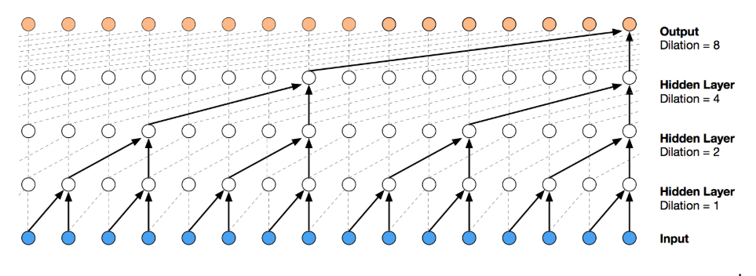
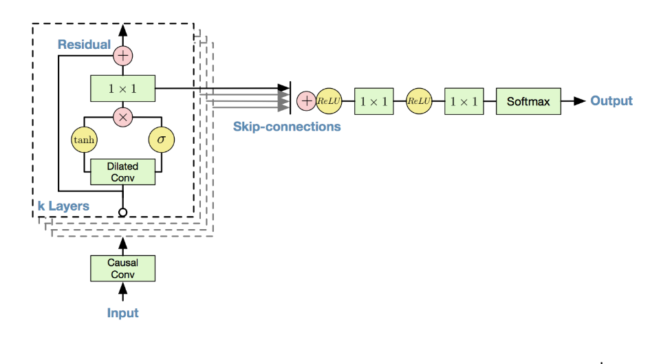
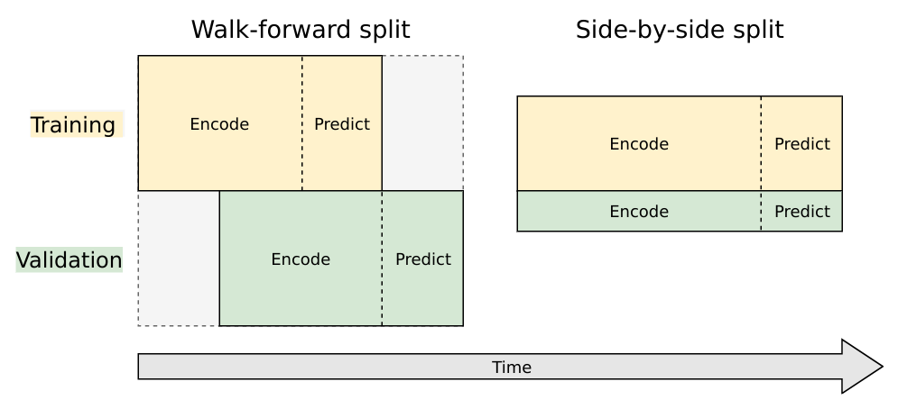

# Machine Learning Engineer Nanodegree
## Capstone Project
Lalit Yadav 
June 23, 2019

## I. Definition

### Project Overview

This is a competition hosted on Kaggle, the dataset has been taken from Kaggle.

### Problem Statement
This project is about predicting the future behaviour of time series’ that describe the web traffic for Wikipedia articles. The data contains about 145k time series and comes in two separate files: train_2.csv holds the traffic data, where each column is a date and each row is an article, and key_2.csv contains a mapping between page names and a unique ID column (to be used in the submission file).

Each of these time series represent a number of daily views of a different Wikipedia article, starting from July, 1st, 2015 up until December 31st, 2016. The leaderboard during the training stage is based on traffic from January, 1st, 2017 up until  September 10th, 2017. The goal is to forecast the daily views between September 13th, 2017 and November 13th, 2017 (64 data points) for each article in the dataset.

### Metrics
 <a href="https://en.wikipedia.org/wiki/Symmetric_mean_absolute_percentage_error"> SMAPE </a>  (target loss for competition) can't be used directly, because of unstable behavior near zero values (loss is a step function if truth value is zero, and not defined, if predicted value is also zero).

I used MAE loss on log1p(data), it's smooth almost everywhere and close enough to SMAPE for training purposes.

mean absolute error (MAE) is a measure of difference between two continuous variables. Assume X and Y are variables of paired observations that express the same phenomenon. Examples of Y versus X include comparisons of predicted versus observed, subsequent time versus initial time, and one technique of measurement versus an alternative technique of measurement. Consider a scatter plot of n points, where point i has coordinates (xi, yi)... Mean Absolute Error (MAE) is the average vertical distance between each point and the identity line. MAE is also the average horizontal distance between each point and the identity line.

The Mean Absolute Error is given by:

\begin{align*}
{MAE} = \frac{\sum_{i=1}^{n}{|y_{i}-x_{i}|}}{n}
\end{align*}

## II. Analysis
_(approx. 2-4 pages)_

### Data Exploration
- This challenge is about predicting the future behaviour of time series’ that describe the web traffic for Wikipedia articles. The data contains about 145k time series
- The train_1.csv file has data from `2015-07-01` to `2016-12-31`
- The train_2.csv file has data from `2015-07-01` to `2017-09-10`
- We will be using data from train_2.csv for our training. Which had all data from train_1.csv and additional record. It has records from `July, 1st, 2015` to `September 1st, 2017`
- We have to predict daily page views between `September 13th, 2017` to `November 13th, 2017`.
- key_*.csv gives the mapping between the page names and the shortened Id column used for prediction
> Download input files from https://www.kaggle.com/c/web-traffic-time-series-forecasting/data

### Exploratory Visualization
In this section, you will need to provide some form of visualization that summarizes or extracts a relevant characteristic or feature about the data. The visualization should adequately support the data being used. Discuss why this visualization was chosen and how it is relevant. Questions to ask yourself when writing this section:
- _Have you visualized a relevant characteristic or feature about the dataset or input data?_
- _Is the visualization thoroughly analyzed and discussed?_
- _If a plot is provided, are the axes, title, and datum clearly defined?_

### Algorithms and Techniques

This convolutional architecture is a full-fledged version of the WaveNet model, designed as a generative model for audio (in particular, for text-to-speech applications). The wavenet model can be abstracted beyond audio to apply to any time series forecasting problem, providing a nice structure for capturing long-term dependencies without an excessive number of learned weights.

The core building block of the wavenet model is the dilated causal convolution layer, This style of convolution properly handles temporal flow and allows the receptive field of outputs to increase exponentially as a function of the number of layers. This structure is nicely visualized by the below diagram from the wavenet paper.

The model also utilizes some other key techniques: gated activations, residual connections, and skip connections. 

**Gated Activations**
One of the potential advantages that wavenet has is
that it contains multiplicative units (in the form of the LSTM gates),
which may help it to model more complex interactions. To amend
this, DeepMind replaced the rectified linear units between the
masked convolutions in the original pixelCNN with the following
gated activation unit:
𝑦 = tanh (𝑊𝑘,𝑓 ∗ 𝑥) ⊙ 𝜎(𝑊𝑘,𝑔 ∗ 𝑥)
 where ∗ denotes a convolution operator, ⊙ denotes an elementwise multiplication operator, σ(·) is a sigmoid function, 𝑘 is the layer
index, 𝑓 and 𝑔 denote filter and gate, respectively, and W is a
learnable convolution filter.

**Residual and Skip Connections**
Both residual and parameterized skip connections are used
throughout the network, to speed up convergence and enable
training of much deeper models.

**Our Architecture**

- 16 dilated causal convolutional blocks
- Preprocessing and postprocessing (time distributed) fully connected layers (convolutions with filter width 1): 
- 18 output units
- 32 filters of width 2 per block
- Exponentially increasing dilation rate with a reset (1, 2, 4, 8, 16, 32, 64, 128, 256, 1, 2, 4, 8, 16, 32, 64, 128, 256)
- Gated activations 
- Residual and skip connections
- 2 (time distributed) fully connected layers to map sum of skip outputs to final output

- _Are the algorithms you will use, including any default variables/parameters in the project clearly defined?_
- _Are the techniques to be used thoroughly discussed and justified?_
- _Is it made clear how the input data or datasets will be handled by the algorithms and techniques chosen?_

### Benchmark
In this section, you will need to provide a clearly defined benchmark result or threshold for comparing across performances obtained by your solution. The reasoning behind the benchmark (in the case where it is not an established result) should be discussed. Questions to ask yourself when writing this section:
- _Has some result or value been provided that acts as a benchmark for measuring performance?_
- _Is it clear how this result or value was obtained (whether by data or by hypothesis)?_

## III. Methodology
_(approx. 3-5 pages)_

### Data Preprocessing
There are two ways to split timeseries into training and validation datasets:

Walk-forward split. This is not actually a split: we train on full dataset and validate on full dataset, using different timeframes. Timeframe for validation is shifted forward by one prediction interval relative to timeframe for training.
Side-by-side split. This is traditional split model for mainstream machine learning. Dataset splits into independent parts, one part used strictly for training and another part used strictly for validation.

Walk-forward is preferable, because it directly relates to the competition goal: predict future values using historical values. But this split consumes datapoints at the end of timeseries, thus making hard to train model to precisely predict the future.

A great explanation has been provided in <a href="https://github.com/Arturus/kaggle-web-traffic/blob/master/how_it_works.md"> Arthur's </a> web traffic solution.

To train our model we will divide the data in training and validation set using below logic:

1. Train encoding period
2. Train decoding period (train targets, 64 days)
3. Validation encoding period
4. Validation decoding period (validation targets, 64 days)

### Implementation
In this section, the process for which metrics, algorithms, and techniques that you implemented for the given data will need to be clearly documented. It should be abundantly clear how the implementation was carried out, and discussion should be made regarding any complications that occurred during this process. Questions to ask yourself when writing this section:
- _Is it made clear how the algorithms and techniques were implemented with the given datasets or input data?_
- _Were there any complications with the original metrics or techniques that required changing prior to acquiring a solution?_
- _Was there any part of the coding process (e.g., writing complicated functions) that should be documented?_

### Refinement
In this section, you will need to discuss the process of improvement you made upon the algorithms and techniques you used in your implementation. For example, adjusting parameters for certain models to acquire improved solutions would fall under the refinement category. Your initial and final solutions should be reported, as well as any significant intermediate results as necessary. Questions to ask yourself when writing this section:
- _Has an initial solution been found and clearly reported?_
- _Is the process of improvement clearly documented, such as what techniques were used?_
- _Are intermediate and final solutions clearly reported as the process is improved?_

## IV. Results

### Model Evaluation and Validation
In this section, the final model and any supporting qualities should be evaluated in detail. It should be clear how the final model was derived and why this model was chosen. In addition, some type of analysis should be used to validate the robustness of this model and its solution, such as manipulating the input data or environment to see how the model’s solution is affected (this is called sensitivity analysis). Questions to ask yourself when writing this section:
- _Is the final model reasonable and aligning with solution expectations? Are the final parameters of the model appropriate?_
- _Has the final model been tested with various inputs to evaluate whether the model generalizes well to unseen data?_
- _Is the model robust enough for the problem? Do small perturbations (changes) in training data or the input space greatly affect the results?_
- _Can results found from the model be trusted?_

### Justification
In this section, your model’s final solution and its results should be compared to the benchmark you established earlier in the project using some type of statistical analysis. You should also justify whether these results and the solution are significant enough to have solved the problem posed in the project. Questions to ask yourself when writing this section:
- _Are the final results found stronger than the benchmark result reported earlier?_
- _Have you thoroughly analyzed and discussed the final solution?_
- _Is the final solution significant enough to have solved the problem?_

## V. Conclusion

### Free-Form Visualization
We predicted the data for last 64 days in the dataset through our model. The following are the trends for 6 random Wikipedia articles of our choice. As you can see the trends for the log of page views are being captured quiet well. The peaks are still hard to capture as is the case for all time series forecasting.

- _Have you visualized a relevant or important quality about the problem, dataset, input data, or results?_
- _Is the visualization thoroughly analyzed and discussed?_
- _If a plot is provided, are the axes, title, and datum clearly defined?_

### Reflection
This project was 

- _Have you thoroughly summarized the entire process you used for this project?_
- _Were there any interesting aspects of the project?_
- _Were there any difficult aspects of the project?_
- _Does the final model and solution fit your expectations for the problem, and should it be used in a general setting to solve these types of problems?_

### Improvement
In this section, you will need to provide discussion as to how one aspect of the implementation you designed could be improved. As an example, consider ways your implementation can be made more general, and what would need to be modified. You do not need to make this improvement, but the potential solutions resulting from these changes are considered and compared/contrasted to your current solution. Questions to ask yourself when writing this section:
- _Are there further improvements that could be made on the algorithms or techniques you used in this project?_
- _Were there algorithms or techniques you researched that you did not know how to implement, but would consider using if you knew how?_
- _If you used your final solution as the new benchmark, do you think an even better solution exists?_

-----------

**Before submitting, ask yourself. . .**

- Does the project report you’ve written follow a well-organized structure similar to that of the project template?
- Is each section (particularly **Analysis** and **Methodology**) written in a clear, concise and specific fashion? Are there any ambiguous terms or phrases that need clarification?
- Would the intended audience of your project be able to understand your analysis, methods, and results?
- Have you properly proof-read your project report to assure there are minimal grammatical and spelling mistakes?
- Are all the resources used for this project correctly cited and referenced?
- Is the code that implements your solution easily readable and properly commented?
- Does the code execute without error and produce results similar to those reported?

### References

- Kaggle
  - https://www.kaggle.com/c/web-traffic-time-series-forecasting/discussion
- Kernels
  - https://www.kaggle.com/c/web-traffic-time-series-forecasting/discussion/43795#latest-525730
  - https://www.kaggle.com/headsortails/wiki-traffic-forecast-exploration-wtf-eda
  - https://www.kaggle.com/muonneutrino/wikipedia-traffic-data-exploration
- SMAPE
  - https://en.wikipedia.org/wiki/Symmetric_mean_absolute_percentage_error
- MAE 
  - https://en.wikipedia.org/wiki/Mean_absolute_error
- Other Resources used for this project
  - https://github.com/JEddy92/TimeSeries_Seq2Seq
  - https://github.com/Arturus/kaggle-web-traffic
  - https://towardsdatascience.com/web-traffic-forecasting-f6152ca240cb